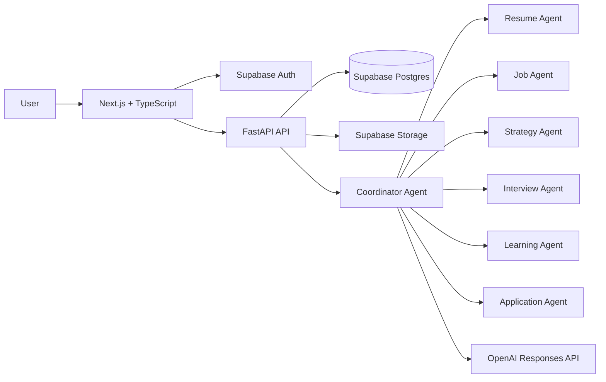
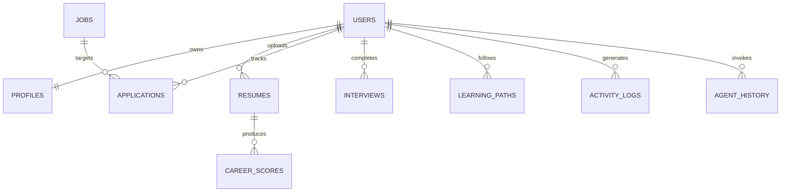
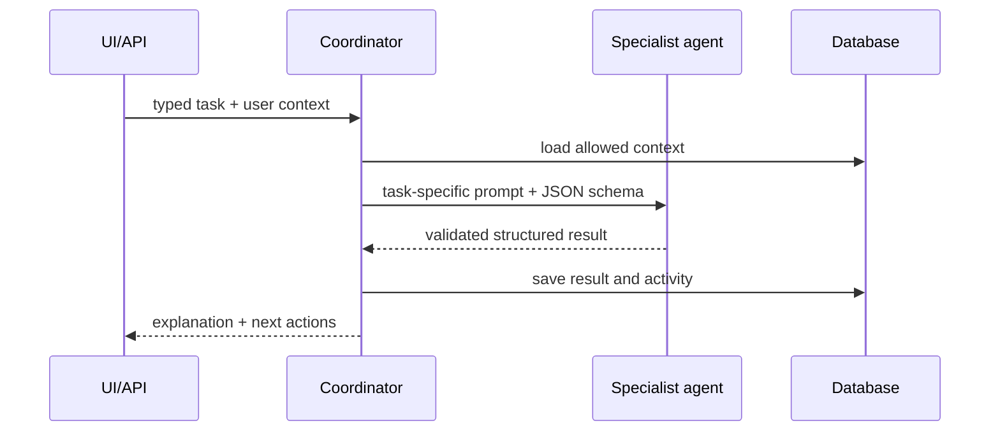

# CareerPilot OS — Project Bible

**Version:** 1.0  
**Status:** MVP feature freeze  
**Product:** OpenAI Build Week 2026

## 1. Product constitution

### 1.1 Mission

CareerPilot OS is an AI-native career operating system for international students seeking sponsored graduate jobs. It continuously assesses career readiness, explains job fit, improves applications, and directs the next best action.

### 1.2 Product promise

In one session, a user can upload a resume, see a clear Career Health assessment, discover suitable sponsored roles, generate a tailored application, practise an interview answer, and leave with a four-week plan.

### 1.3 MVP boundaries

Build only the modules below. A feature must improve technical difficulty, AI reasoning, product polish, UX, real-world impact, or the demo; otherwise defer it.

| In scope | Explicitly out of scope |
| --- | --- |
| Resume upload and analysis | Automatic job applications |
| Curated/demo job search and ranking | Live scraping requiring fragile integrations |
| Tailored resume content and cover letter | Legal immigration advice |
| Interview question, evaluation, feedback | Video interview analysis |
| Application tracker and 4-week strategy | Native mobile apps, teams, payments |

### 1.4 Success criteria

- A first-time user reaches a credible Career Health result in under three minutes.
- Every job-fit score has human-readable reasons, gaps, and a next action.
- Generated application material is editable and never overwrites the source resume.
- The complete core journey is demonstrable in three minutes with seeded data.

## 2. Personas and core journeys

**Primary persona — international graduate:** Has a resume, needs sponsorship-aware roles, is unsure which gaps matter, and wants practical weekly direction.

**Core journey:** Sign in → upload PDF resume → validate extracted profile → view Career Health → search jobs → inspect fit reasoning → tailor resume → generate cover letter → track application → practise an interview question → view updated next actions.

## 3. Information architecture and UX

### 3.1 Routes

| Route | Purpose | Key content |
| --- | --- | --- |
| `/` | Landing | value proposition, workflow, CTA |
| `/login`, `/register` | Authentication | Supabase auth forms |
| `/dashboard` | Daily command centre | health, actions, activity, progress |
| `/resume` | Resume intelligence | upload, extracted data, analysis, variants |
| `/jobs` | Discovery | filters, job cards, explainable ranking |
| `/applications` | Pipeline | status board, deadlines, follow-ups |
| `/interview` | Interview coach | question, answer, evaluation |
| `/strategy` | Career strategy | 4-week roadmap and priorities |
| `/settings` | Preferences | target role, country, sponsorship needs |

### 3.2 Design system

- Modern, calm SaaS UI; dark mode and responsive layout from day one.
- Desktop: persistent sidebar; mobile: drawer navigation.
- Use one primary action per screen. Preserve clear empty, loading, and error states.
- Career Health uses semantic status labels alongside colour: Strong, Developing, At risk.
- Never show an unexplained score. Pair each score with contributing factors and an action.

### 3.3 Component map

`AppShell` contains `Sidebar`, `Topbar`, and a page outlet. Shared primitives include `MetricCard`, `ScoreRing`, `EmptyState`, `LoadingSkeleton`, `ErrorState`, `ReasonList`, `StatusBadge`, and `ActionCard`. Feature components live beside their route domain.

## 4. Architecture

### 4.1 System design



### 4.2 Technology decisions

| Layer | Choice | Reason |
| --- | --- | --- |
| Web app | Next.js, TypeScript, Tailwind, shadcn/ui, Framer Motion | polished, fast UI |
| API | FastAPI, Pydantic | typed contracts and automatic OpenAPI |
| Data/auth/storage | Supabase | fast, managed foundation |
| AI | OpenAI Responses API with JSON-schema outputs | reliable explainable structured results |
| PDF extraction | server-side PDF text extraction | preserves user workflow and keeps UI thin |

### 4.3 Repository structure

```text
careerpilot-os/
├── frontend/
│   ├── app/ components/ features/ hooks/ services/ types/ styles/
├── backend/
│   ├── routers/ agents/ services/ repositories/ schemas/ database/ prompts/ utils/
├── docs/
└── README.md
```

### 4.4 Frontend responsibilities

The frontend owns rendering, interaction state, client-side validation, authenticated API calls, and optimistic UI only where safe. It must not contain prompt text or service-role credentials.

### 4.5 Backend responsibilities

The API owns authorization, PDF processing, persistence, agent orchestration, OpenAI calls, validation, observability, and all sensitive credentials. Routes are versioned under `/api/v1`.

## 5. Data design

All primary records use UUIDs, `created_at`, and `updated_at`. User-owned tables enforce row-level security by `user_id`.



| Table | Essential fields |
| --- | --- |
| `profiles` | `user_id`, `full_name`, `target_role`, `target_country`, `needs_sponsorship`, `skills` |
| `resumes` | `user_id`, `file_path`, `source_text`, `parsed_json`, `is_original`, `version_name` |
| `career_scores` | `user_id`, `resume_id`, `overall`, `ats`, `skills`, `projects`, `communication`, `analysis_json` |
| `jobs` | `title`, `company`, `location`, `country`, `description`, `skills`, `sponsorship_status`, `source_url` |
| `applications` | `user_id`, `job_id`, `resume_id`, `status`, `deadline`, `follow_up_at`, `notes` |
| `interviews` | `user_id`, `job_id`, `question`, `answer`, `evaluation_json`, `score` |
| `learning_paths` | `user_id`, `goal`, `roadmap_json`, `active` |
| `activity_logs` | `user_id`, `event_type`, `metadata_json` |
| `agent_history` | `user_id`, `agent_name`, `input_json`, `output_json`, `status` |

## 6. API contract

All responses use `{ "data": ..., "meta": ... }`; errors use `{ "error": { "code", "message", "details" } }`. All user routes require a validated bearer token.

| Method and path | Request | Response |
| --- | --- | --- |
| `GET /api/v1/health` | — | service status |
| `POST /api/v1/resume/upload` | multipart PDF | resume ID and extracted text status |
| `POST /api/v1/resume/analyze` | `resume_id` | `CareerHealth` |
| `POST /api/v1/jobs/search` | role, country, skills, sponsorship | ranked `JobMatch[]` |
| `POST /api/v1/resume/tailor` | resume ID, job ID | preserved variant + rationale |
| `POST /api/v1/cover-letter` | resume ID, job ID | editable letter |
| `POST /api/v1/interview/start` | job ID, type | question and session ID |
| `POST /api/v1/interview/evaluate` | session ID, answer | structured feedback |
| `POST /api/v1/career/strategy` | profile and resume ID | 4-week roadmap |
| `GET /api/v1/dashboard` | — | dashboard aggregate |
| `GET /api/v1/applications` | optional status | applications |
| `POST /api/v1/applications` | job ID, status, dates | application |

### 6.1 Canonical JSON shapes

```json
{
  "CareerHealth": {
    "overall_score": 0,
    "dimensions": [{"name": "ATS readiness", "score": 0, "summary": ""}],
    "strengths": [""],
    "gaps": [{"gap": "", "impact": "high", "next_step": ""}],
    "priority_actions": [""]
  },
  "JobMatch": {
    "job_id": "uuid",
    "fit_score": 0,
    "sponsorship_compatibility": "confirmed|likely|unknown|unlikely",
    "why_match": [""],
    "missing_skills": [""],
    "interview_readiness": "low|medium|high",
    "next_action": ""
  }
}
```

## 7. AI agent system

### 7.1 Coordinator policy

The Coordinator accepts a typed task, loads only the minimum user context, chooses one or more specialist agents, validates each structured output, persists the history, and returns a user-facing summary. It does not fabricate facts, immigration eligibility, job availability, or sponsorship status.



| Agent | Inputs | Outputs |
| --- | --- | --- |
| Resume | resume text, target role | parsed profile, health, tailoring |
| Job | profile, filters, jobs | ranked matches and reasons |
| Strategy | health, matches, goals | 4-week plan |
| Interview | role, job, answer | question, STAR evaluation, feedback |
| Learning | skill gaps, time available | resources, projects, sequence |
| Application | job, dates, status | pipeline advice, deadline actions |

### 7.2 Prompt standard

Every prompt contains: role, permitted inputs, task, scoring rubric, safety constraints, output JSON schema, and a prohibition on invented evidence. Prompts must return JSON only; display prose is composed by the API/UI from structured fields.

**Base instruction:** “Use only supplied resume and job data. Distinguish evidence from inference. For each recommendation, state the evidence, impact, and one concrete next action. Do not claim sponsorship is available unless the input explicitly says so.”

## 8. Feature acceptance criteria

| Feature | Done when |
| --- | --- |
| Resume upload | rejects invalid files; stores original securely; extraction status is visible |
| Career Health | returns valid dimensions, strengths, gaps, and prioritised actions with no unexplained score |
| Job discovery | filters work; each result explains fit, missing skills, and sponsorship confidence |
| Tailoring | creates a new version; original remains untouched; changes are explained |
| Cover letter | is editable, job-specific, evidence-based, and exportable |
| Applications | supports Applied, Interview, Rejected, Offer; shows upcoming deadlines |
| Interview | asks a relevant question; evaluates answer against STAR and gives retry action |
| Strategy | creates feasible four-week plan linked to identified gaps |

## 9. Engineering standards

- TypeScript strict mode and Python type hints; use shared API types generated or maintained from OpenAPI.
- Validate all external input. Never trust client-supplied user IDs.
- Use environment variables for secrets; commit only `.env.example`.
- Log request IDs, route, latency, and safe error context. Never log resume text or tokens.
- Add loading, empty, error, and permission states for every async screen.
- Unit-test score transformations and repositories; integration-test auth boundaries and core API routes; perform one full demo E2E test.
- Accessibility: keyboard navigation, semantic controls, visible focus states, labelled charts, and adequate contrast.

## 10. Delivery plan and feature freeze

| Day | Outcome |
| --- | --- |
| 1 | scaffolded, navigable app; API health check; schema and auth connected |
| 2 | resume upload → Career Health “wow” flow |
| 3 | job ranking → tailoring → cover letter flow |
| 4 | coordinator workflow, strategy, interview, applications |
| 5 | testing, documentation, deployment, recorded demo; no feature additions |

## 11. Demo script

| Time | Demonstration |
| --- | --- |
| 0:00–0:20 | Landing and sign-in |
| 0:20–0:50 | Upload resume; Career Health appears |
| 0:50–1:30 | Search UK data science roles; show ranking reasoning and sponsorship confidence |
| 1:30–2:00 | Tailor resume and generate cover letter |
| 2:00–2:30 | Show four-week career strategy and next action |
| 2:30–3:00 | Answer an interview question; show feedback and updated health action |

## 12. Build checklist

- [ ] Create frontend shell, auth, navigation, theme, shared states
- [ ] Create FastAPI app, config, health route, OpenAPI and logging
- [ ] Apply Supabase schema, RLS policies, storage bucket
- [ ] Implement resume-to-health vertical slice end-to-end
- [ ] Seed a reliable demo job dataset
- [ ] Implement job-to-application vertical slice
- [ ] Implement strategy and interview slices
- [ ] Test the full demo account, capture screenshots, deploy, record demo
